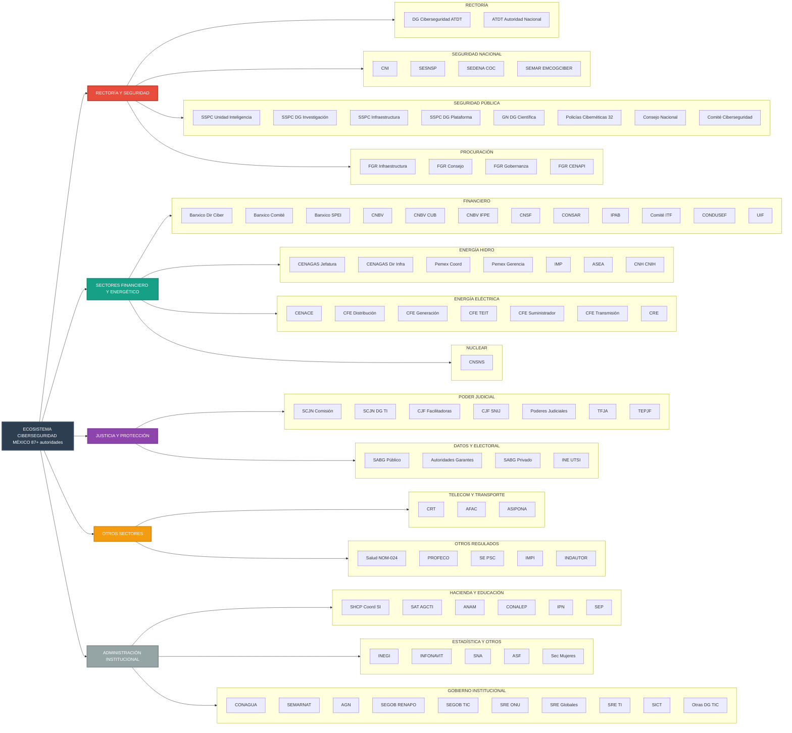

# Mapa de Autoridades de Ciberseguridad en México

En México existe una **proliferación de instrumentos normativos y administrativos** que crean autoridades y les otorgan facultades en el **ámbito de la ciberseguridad y la seguridad de la información**. Esa dispersión provoca **solapamientos de atribuciones**, vacíos de coordinación y decisiones públicas desalineadas.

Este repositorio nace como un **proyecto colaborativo y practitioner** para **identificar, ordenar y describir** a las autoridades que actúan en este dominio, mostrando en un mismo lugar:
- **Autoridad / Órgano**
- **Nivel de gobierno**
- **Sector / ámbito**
- **Tipo de rol en ciberseguridad**
- **Funciones relacionadas con ciberseguridad (síntesis)**
- **Fundamento legal (norma, art., fracción)**
- **Notas / limitaciones**

> **Tablas completas por rubro:**  
> ➜ [`organizacion_autoridades_por_rubros.md`](./organizacion_autoridades_por_rubros.md)

---

## ¿Qué problema resuelve?
El **sistema jurídico-administrativo** en ciberseguridad está **fragmentado** y carece de un mapeo público consolidado. Este proyecto facilita una **vista clara y verificable** para evitar duplicidades, entender **quién hace qué** y sostener decisiones informadas.

---

## Alcance: rubros y roles

**Rubros principales (ejemplos):**
- Gobernanza y rectoría federal
- Seguridad nacional e inteligencia
- Seguridad pública y prevención del delito
- Sector financiero
- Sector energético: hidrocarburos y gas natural; energía eléctrica; nuclear
- Poder Judicial y justicia
- Procuración de justicia
- Protección de datos personales
- Telecomunicaciones
- Transporte y aviación
- Hacienda y administración tributaria
- Educación
- Salud
- Vivienda y seguridad social
- Estadística y geografía
- Anticorrupción y transparencia
- Género y protección de víctimas
- Recursos hídricos y medio ambiente
- Archivos y gestión documental
- Población e identidad
- Electoral
- Política exterior
- Consumo y comercio electrónico
- Propiedad intelectual
- Otras direcciones generales TIC sectoriales

**Tipos de rol (estandarizados):**  
**Normativo/Regulador · Supervisor · Operativo/CSIRT · Coordinación · Inteligencia · Diplomacia · Operación institucional**

---

## ¿Para quién es útil?
- **Legisladores y congresos** (federal y locales)
- **Policymakers** y diseñadores de política pública
- **Reguladores sectoriales** y **autoridades coordinadoras**
- **Empresas** (incl. operadores de infraestructura crítica) y **cámaras**
- **CSIRTs**, **equipos de respuesta**, **equipos de cumplimiento**
- **Academia**, **investigadores**, **think tanks**
- **Sociedad civil** y **periodismo especializado**

 ---  

## Cómo leer el repositorio
- La **tabla por rubros** concentra la información estructurada, con su **fundamento legal** y **notas** de alcance o limitaciones.  
  ➜ [`organizacion_autoridades_por_rubros.md`](./organizacion_autoridades_por_rubros.md)

- El **diagrama** ofrece una vista de alto nivel del ecosistema y relaciones.

<strong>Ver diagrama (Mermaid)</strong>

---
## 🤝 Sugerencias y mejoras

Este mapa está en evolución. Si encuentras una autoridad faltante, un fundamento por afinar o una mejor forma de clasificar, será un gusto leerte.

**Contacto:** https://mx.linkedin.com/in/jersain

**Formato sugerido (copia y pega en tu mensaje):**
- Autoridad / Órgano:
- Nivel de gobierno:
- Sector / ámbito:
- Rol en ciberseguridad:
- Funciones (2-4 líneas):
- Fundamento legal (instrumento + art./fracc. + DOF + URL oficial):
- Notas / limitaciones:

---

---
