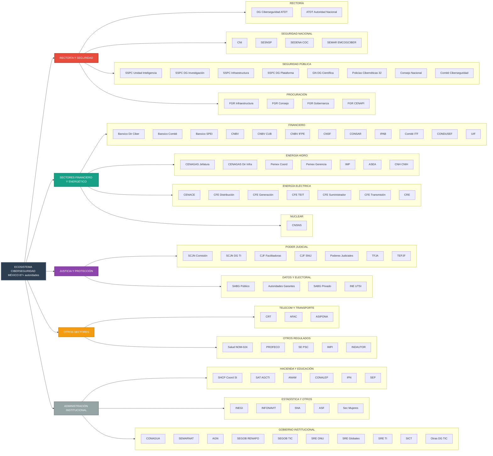

# Organización de Autoridades en Ciberseguridad por Rubros

_Actualizado: 11 Nov 2025_

> **Tip:** En pantallas pequeñas, las tablas se pueden desplazar horizontalmente ↔.

<strong>Ver grafo Mermaid (mapa general)</strong>

## Índice
- [1. Gobernanza y Rectoría Federal](#1-gobernanza-y-rectoría-federal)
- [2. Seguridad Nacional e Inteligencia](#2-seguridad-nacional-e-inteligencia)
- [3. Seguridad Pública y Prevención del Delito](#3-seguridad-pública-y-prevención-del-delito)
- [4. Sector Financiero](#4-sector-financiero)
- [5. Sector Energético](#5-sector-energético)
  - [5.1 Hidrocarburos y Gas Natural](#51-hidrocarburos-y-gas-natural)
  - [5.2 Energía Eléctrica](#52-energía-eléctrica)
  - [5.3 Nuclear](#53-nuclear)
- [6. Poder Judicial y Justicia](#6-poder-judicial-y-justicia)
- [7. Procuración de Justicia](#7-procuración-de-justicia)
- [8. Protección de Datos Personales](#8-protección-de-datos-personales)
- [9. Telecomunicaciones](#9-telecomunicaciones)
- [10. Transporte y Aviación](#10-transporte-y-aviación)
- [11. Hacienda y Administración Tributaria](#11-hacienda-y-administración-tributaria)
- [12. Educación](#12-educación)
- [13. Salud](#13-salud)
- [14. Vivienda y Seguridad Social](#14-vivienda-y-seguridad-social)
- [15. Estadística y Geografía](#15-estadística-y-geografía)
- [16. Anticorrupción y Transparencia](#16-anticorrupción-y-transparencia)
- [17. Género y Protección de Víctimas](#17-género-y-protección-de-víctimas)
- [18. Recursos Hídricos y Medio Ambiente](#18-recursos-hídricos-y-medio-ambiente)
- [19. Archivos y Gestión Documental](#19-archivos-y-gestión-documental)
- [20. Población e Identidad](#20-población-e-identidad)
- [21. Electoral](#21-electoral)
- [22. Política Exterior](#22-política-exterior)
- [23. Consumo y Comercio Electrónico](#23-consumo-y-comercio-electrónico)
- [24. Propiedad Intelectual](#24-propiedad-intelectual)
- [25. Otras Direcciones Generales de TIC sectoriales](#25-otras-direcciones-generales-de-tic-sectoriales)

---

## 1. Gobernanza y Rectoría Federal

| Autoridad / Órgano | Nivel de gobierno | Sector / ámbito | Tipo de rol en ciberseguridad | Funciones relacionadas con ciberseguridad (síntesis) | Fundamento legal (norma, art., fracción) | Notas / limitaciones |
|---|---|---|---|---|---|---|
| Dirección General de Ciberseguridad (Agencia de Transformación Digital y Telecomunicaciones) | Federal - Órgano desconcentrado | Administración Pública Federal | Normativo/regulador, Coordinación, Supervisor | Diseñar estrategias y marco de gobierno de ciberseguridad para la APF; emitir políticas, lineamientos y reglamentos; gestionar auditorías vinculantes; coordinar respuesta a incidentes; proponer protocolos de seguridad de información | Reglamento Interior de la Agencia de Transformación Digital y Telecomunicaciones, Art. 19, fracciones I-XIV | Autoridad rectora para toda la APF en ciberseguridad |
| Agencia de Transformación Digital y Telecomunicaciones (ATDT) – Autoridad Nacional de Simplificación y Digitalización | Federal – Centralizada | Transversal (mejora regulatoria y digitalización gubernamental) | Metarregulación de normas (incluye ciber-normas); emisión de lineamientos; dictaminación de AIR; gestión de Registro y Portal; coordinación nacional | Define y supervisa buenas prácticas regulatorias y dictamina el Análisis de Impacto Regulatorio (AIR) de propuestas normativas; opera Portal Ciudadano Único y Registro Nacional de Regulaciones; emite lineamientos de aplicación nacional; fija la Estrategia Digital Nacional e impone criterios de seguridad de la información y ciberseguridad en la digitalización pública | Ley Nacional para Eliminar Trámites Burocráticos (LNELTB): Art. 8 (ATDT como Autoridad Nacional); Art. 9–10 (atribuciones; AIR); Arts. 33–44 (AIR); Arts. 51–56 (Portal/Registro); Art. 62 (Estrategia Digital Nacional); Art. 6, fr. XIII (principio de ciberseguridad); Art. 25, IV–VI (controles de SI/estándares contra ciberamenazas) | No es regulador sectorial de ciberseguridad (no emite controles técnicos sectoriales); su rol es procedimental y transversal (metarregulación). Excepciones de aplicabilidad: SEDENA/SEMAR fuera del alcance salvo en obligaciones de simplificación/digitalización/portal. CONAMER quedó extinguida; referencias pasan a ATDT |

[Volver al índice](#índice)

---

## 2. Seguridad Nacional e Inteligencia

| Autoridad / Órgano | Nivel de gobierno | Sector / ámbito | Tipo de rol en ciberseguridad | Funciones relacionadas con ciberseguridad (síntesis) | Fundamento legal (norma, art., fracción) | Notas / limitaciones |
|---|---|---|---|---|---|---|
| Centro Nacional de Inteligencia (CNI) | Federal - Órgano desconcentrado | Seguridad nacional | Inteligencia, Coordinación, Capacitación | Diseñar programas de capacitación en ciberseguridad; establecer metodologías para análisis criminal; gestionar proyectos TIC de carácter de seguridad nacional | Ley del Sistema Nacional de Investigación e Inteligencia en Materia de Seguridad Pública, Art. 25, 34, 49 | Gestiona proyectos TIC de seguridad nacional |
| Secretariado Ejecutivo del Sistema Nacional de Seguridad Pública (SESNSP) | Federal – Órgano administrativo del Consejo Nacional | Seguridad pública | Coordinación interinstitucional; certificación en inteligencia; administrador del Sistema Nacional de Información (SNI) | Administra el Sistema Nacional de Información consultable por el CNI. Emite la certificación en inteligencia para agentes que acceden a información de la Plataforma. Con el CNI, diseña e implementa programas y cursos (incluyendo TI y ciberseguridad) y mecanismos de evaluación y certificación. Evalúa, junto con la Secretaría y el CNI, el cumplimiento de las secretarías estatales respecto de la Ley y sus lineamientos | Ley del Sistema Nacional de Investigación e Inteligencia en Materia de Seguridad Pública: arts. 27 (SNI a cargo del SESNSP), 48 (certificación del SESNSP), 49 (programas y certificación en coordinación con CNI), 46 (evaluación conjunta) | No opera CSIRT propio; su papel es de certificación, información y coordinación, no operativo |
| Secretaría de la Defensa Nacional (SEDENA) – Centro de Operaciones del Ciberespacio (COC) | Federal – Centralizada | Defensa nacional | Operativo/CSIRT, Ciberdefensa, Coordinación | Planear, coordinar y ejecutar operaciones en el ciberespacio; proteger información e infraestructura crítica de SEDENA; respuesta a incidentes; capacitación específica del personal del COC | Programa Sectorial de Defensa Nacional 2013–2018 (meta: "contar con un COC"); Programa Sectorial 2020–2024 (capacitar personal del COC para protección de infraestructuras críticas) | El inicio de operaciones del COC está documentado en la Memoria Documental 2018–2024 (1 de junio de 2016); el detalle organizacional es principalmente programático/administrativo (no hay un acuerdo DOF de creación pública del COC) |
| Secretaría de Marina (SEMAR) – Coordinadora General del Ciberespacio (EMCOGCIBER) | Federal – Centralizada | Marina / Defensa nacional | Operativo/CSIRT, Ciberdefensa, Coordinación | Gobernanza del ciberespacio en SEMAR; seguridad de la información, ciberseguridad y ciberdefensa; operación de capacidades especializadas y formación de la fuerza cibernética | Acuerdo Secretarial Núm. 335/2022 (la Unidad de Ciberseguridad se constituye en EMCOGCIBER); antecedente Acuerdo Secretarial Núm. 033/2017 (creación de la Unidad de Ciberseguridad) | Rol operativo y de coordinación dentro del sector marítimo–naval; coordinación con otras entidades de seguridad nacional |

[Volver al índice](#índice)

---

## 3. Seguridad Pública y Prevención del Delito

| Autoridad / Órgano | Nivel de gobierno | Sector / ámbito | Tipo de rol en ciberseguridad | Funciones relacionadas con ciberseguridad (síntesis) | Fundamento legal (norma, art., fracción) | Notas / limitaciones |
|---|---|---|---|---|---|---|
| Unidad de Inteligencia, Investigación Cibernética y Operaciones Tecnológicas (SSPC) | Federal - Centralizada | Seguridad pública | Operativo, Investigación, Persecución penal | Coordinar políticas de prevención de delitos cibernéticos; monitorear Internet; investigar hechos delictivos; prestar auxilio para intervención de comunicaciones; elaborar políticas de ciberseguridad | Reglamento Interior de la SSPC, Art. 38, fracciones I-XXV | Funciones de inteligencia y operaciones tecnológicas |
| Dirección General de Investigación Cibernética (SSPC) | Federal - Centralizada | Seguridad pública | Operativo, Prevención | Implementar políticas de prevención; detectar conductas delictivas en Internet; coadyuvar en investigación de delitos cibernéticos; adoptar medidas contra vulneraciones | Reglamento Interior de la SSPC, Art. 39, fracciones I-XII | Subordinada a la Unidad de Inteligencia |
| Unidad de Infraestructura Informática y Vinculación Tecnológica (SSPC) | Federal – Centralizada | Seguridad pública | Coordinación tecnológica (Plataforma México) | Someter directrices y lineamientos TIC; proponer mecanismos de coordinación para la operación de Plataforma México; coordinar la red de telecomunicaciones e interconexiones de Plataforma México | Reglamento Interior de la SSPC, art. 42, fraccs. I, IV–VI | Enlace TIC–seguridad pública; enfoque en infraestructura y conectividad de Plataforma México |
| Dirección General de Plataforma México (SSPC) | Federal – Centralizada | Seguridad pública | Operación de plataforma nacional | Dirigir instalación, mantenimiento y operación de la infraestructura; administrar cuentas "a fin de garantizar la seguridad de la información"; emitir lineamientos técnicos y asegurar disponibilidad de servicios | Reglamento Interior de la SSPC, art. 43, fraccs. I–IV, VII–VIII | Rol operativo y de hardening/lineamientos dentro de Plataforma México |
| Dirección General Científica (Guardia Nacional) | Federal - Órgano desconcentrado | Seguridad pública | Operativo/CSIRT, Prevención, Coordinación | Opera Centro Nacional de Respuesta a Incidentes Cibernéticos y Centro de Delitos Electrónicos contra Menores; coordinación con equipos internacionales FIRST | Protocolo Nacional de Coordinación Interinstitucional; Ley de la Guardia Nacional Art. 9, fracciones XXIX y XXXVIII; Reglamento Art. 36 fracción XVI | Coordinación internacional con Forum for Incident Response and Security Teams |
| Policías Cibernéticas de las Entidades Federativas | Estatal | Seguridad pública | Operativo, Investigación | Prevención e investigación de delitos cibernéticos a nivel estatal; integradas al Modelo Homologado de Unidades de Policía Cibernética | Acuerdo 12/XL/16 del Consejo Nacional de Seguridad Pública (D.O.F. 09/09/2016) | 32 unidades con capacidades heterogéneas |
| Consejo Nacional de Seguridad Pública | Federal - Colegiado | Seguridad pública | Coordinación nacional | Aprobación del Modelo Homologado de Unidades de Policía Cibernética; coordinación del Sistema Nacional de Seguridad Pública | Acuerdo 12/XL/16 del CNSP | Instancia de coordinación, no operativa |
| Comité de Ciberseguridad Unidades de Policía Cibernética | Federal/Estatal - Colegiado | Seguridad pública | Coordinación operativa | Integrar y coordinar unidades de policía cibernética federales y estatales; fortalecer prevención e investigación en ciberespacio | Protocolo Nacional de Coordinación Interinstitucional | Mecanismo de coordinación interinstitucional |

[Volver al índice](#índice)

---

## 4. Sector Financiero

| Autoridad / Órgano | Nivel de gobierno | Sector / ámbito | Tipo de rol en ciberseguridad | Funciones relacionadas con ciberseguridad (síntesis) | Fundamento legal (norma, art., fracción) | Notas / limitaciones |
|---|---|---|---|---|---|---|
| Dirección de Ciberseguridad (Banco de México) | Federal - Órgano autónomo | Financiero | Normativo sectorial, Operativo/CSIRT, Coordinación sectorial | Establecer políticas de ciberseguridad del Banco y sistema financiero; definir plan de respuesta a incidentes; representar ante grupos de infraestructura crítica nacional; administrar programa de ciberseguridad y ciberresiliencia | Reglamento Interior del Banco de México, Art. 29 Bis, fracciones I-XVI (D.O.F. 29/12/2020) | Autoridad para sector financiero y sistemas de pagos |
| Comité de Tecnologías y Seguridad de la Información (Banco de México) | Federal - Colegiado interno | Financiero | Coordinación institucional | Coordinar implementación de políticas y lineamientos de ciberseguridad en Banxico | Reglamento Interior Banco de México, Art. 29 Bis, fracción III | Órgano colegiado interno |
| Banxico (pagos) – Reglas/Circulares para SPEI y otros sistemas | Federal | Pagos de alto/medio valor | Regulador operativo de pagos (ciber/continuidad/incidentes) | Obliga a participantes a implementar controles de ciberseguridad, continuidad y reportar incidentes operativos/seguridad conforme a Circulares y manuales del sistema | Portales y circulares de Sistemas de Pagos – Banco de México (p.ej., requisitos técnicos, operación y reporte de incidentes para SPEI/otros) | Complementa (no sustituye) lo que ya sentaste para la Dirección de Ciberseguridad de Banxico |
| Comisión Nacional Bancaria y de Valores (CNBV) | Federal - Órgano desconcentrado | Financiero | Supervisor, Normativo sectorial | Preservar seguridad de información de entidades financieras e ITF; emitir disposiciones sobre seguridad de información; acciones de supervisión sobre seguridad de información | Reglamento Interior CNBV, Art. múltiple; Ley para Regular las ITF, Art. 48 | Supervisión del sector financiero y fintech |
| CNBV – Disposiciones de carácter general aplicables a las instituciones de crédito (Circular Única de Bancos) | Federal – Órgano desconcentrado | Financiero (banca múltiple) | Regulador / Supervisor sectorial / Autoridad receptora de reportes de Incidentes de Seguridad de la Información | Autoridad receptora de reportes de Incidentes de Seguridad de la Información: aviso inmediato; envío a CNBV ≤5 días hábiles con Anexos 64 y 64 Bis; plan de trabajo ≤15 días hábiles; conservación de registros de no‐reportables; supervisa la notificación a clientes ≤48 h cuando proceda | CUB, art. 168 Bis 16; Anexos 64 y 64 Bis | Aplica a instituciones de crédito; la notificación a clientes es carga de la institución y es supervisada por la CNBV |
| CNBV – Instituciones de fondos de pago electrónico (IFPE) | Federal | Fintech (e-money) | Supervisor/Regulador sectorial (SI/incidentes) | Dispone reglas de ciber/seguridad de la información para IFPE e impone plazos de notificación de incidentes y medidas de gestión de riesgos tecnológicos | Disposiciones de carácter general para IFPE (actualizaciones 2023 con reglas de incidentes y ciber) | Útil como doc separado de la CUB bancaria por tratarse de otro sub-sector |
| Comisión Nacional de Seguros y Fianzas (CNSF) | Federal | Seguros y fianzas | Supervisor/Regulador sectorial (SI/ciber) | Opera proceso formal de reporte de incidentes de seguridad de la información (formato "Reporte Inicial", seguimiento y coordinación sectorial) | Bases de coordinación en materia de seguridad de la información (procesos de reporte de incidentes ante CNSF) | Procedimiento específico de notificación sectorial distinto al de datos personales |
| Comisión Nacional del Sistema de Ahorro para el Retiro (CONSAR) | Federal | Pensiones (SAR/AFORE) | Supervisor/Regulador sectorial (SI/continuidad) | Exige políticas de seguridad de la información y planes de recuperación de desastres/continuidad a AFORE y participantes del SAR; supervisa su cumplimiento | Disposiciones de carácter general en materia financiera de los Sistemas de Ahorro para el Retiro (múltiples numerales sobre "seguridad de la información", DRP, autenticación) | Aunque no siempre dice "ciberseguridad", impone controles y gobierno de SI sujetos a supervisión |
| Instituto para la Protección al Ahorro Bancario (IPAB) | Federal - Organismo descentralizado | Financiero | Normativo institucional | Elaborar lineamientos para Sistemas de Gestión de Seguridad de la Información; coordinar acciones en materia de seguridad de información | Estatuto Orgánico IPAB, Art. 28 fracciones II, IV, V (19/06/2023) | Protección del ahorro bancario |
| Comité Interinstitucional (ITF) | Federal - Colegiado | Tecnología financiera | Coordinación regulatoria | Opinar sobre disposiciones de seguridad de información para instituciones de tecnología financiera | Ley para Regular las ITF, Art. 39 fracción V, Art. 48 | Integrado por SHCP, Banxico, CNBV |
| CONDUSEF – Dirección General de Tecnologías de la Información | Federal – Órgano desconcentrado | Financiero (defensa del usuario) | Normativo/operativo institucional | Responsable de la Seguridad de la Información de la CONDUSEF y enlace ante el CNI | Estatuto Orgánico de CONDUSEF, atribuciones de la DGTI (Responsable de Seguridad de la Información y enlace CNI) | Rol institucional de SI; no es supervisor prudencial del sector |
| Unidad de Inteligencia Financiera (UIF), SHCP | Federal – Centralizada (SHCP) | PLD/FT, sistema financiero y "actividades vulnerables" | Inteligencia financiera y coordinación regulatoria (intersección con SI: transmisión/resguardo de avisos y reportes) | Recibe, analiza y disemina avisos y reportes; emite criterios y colabora con autoridades; administra canales seguros de información sensible de sujetos obligados | Reglamento Interior de la SHCP (estructura y atribuciones de la UIF); LFPIORPI (obligaciones de aviso y tratamiento de información) | No es regulador "de ciberseguridad"; su competencia es PLD/FT, con impactos directos en gobierno y seguridad de la información |

[Volver al índice](#índice)

---

## 5. Sector Energético

### 5.1 Hidrocarburos y Gas Natural

| Autoridad / Órgano | Nivel de gobierno | Sector / ámbito | Tipo de rol en ciberseguridad | Funciones relacionadas con ciberseguridad (síntesis) | Fundamento legal (norma, art., fracción) | Notas / limitaciones |
|---|---|---|---|---|---|---|
| Centro Nacional de Control del Gas Natural (CENAGAS) - Jefatura de Unidad de Tecnologías Operacionales | Federal - Empresa productiva del Estado | Energía/Hidrocarburos | Operativo sectorial | Dirigir implementación de ciberseguridad del sistema SCADA; gestionar proyectos TIC ante CNI con carácter de seguridad nacional | Estatuto Orgánico CENAGAS, Art. 49 fracciones III, XII, XXI; Art. 51 | Infraestructura crítica sector energético |
| CENAGAS - Dirección Ejecutiva de Infraestructura Tecnológica y Seguridad de la Información | Federal - Empresa productiva del Estado | Energía/Hidrocarburos | Operativo sectorial | Coordinar e instrumentar mecanismos y controles de seguridad informática; administración de riesgos en sistemas de información | Estatuto Orgánico CENAGAS, Art. 51, fracciones XI, XVI, XXI-XXII | Subordinada a Jefatura de Unidad |
| Petróleos Mexicanos - Coordinación de Servicios de TIC | Federal - Empresa productiva del Estado | Hidrocarburos | Operativo institucional | Coordinar elaboración y administración de estrategia de ciberseguridad de Pemex; supervisar instrumentación de controles de seguridad | Estatuto Orgánico Pemex, Art. 257, fracciones III, V (D.O.F. 12/09/2025) | Infraestructura crítica petrolera |
| Pemex - Gerencia de Servicios Digitales | Federal - Empresa productiva del Estado | Hidrocarburos | Operativo | Supervisar implementación de mecanismos de ciberseguridad; diseñar soluciones de infraestructura TI | Estatuto Orgánico Pemex, Art. 258, fracción III | Subordinada a Coordinación de Servicios TIC |
| Instituto Mexicano del Petróleo - Dirección de Operación Institucional | Federal - Organismo descentralizado | Hidrocarburos/Investigación | Operativo institucional | Establecer políticas de ciberseguridad, seguridad, uso y resguardo de información | Estatuto Orgánico IMP, Art. 23, fracción VI (10/09/2024) | Centro de investigación petrolera |
| Agencia Nacional de Seguridad Industrial (ASEA) | Federal - Órgano desconcentrado | Hidrocarburos | Normativo sectorial | Mantenimiento de información con medidas de seguridad; confidencialidad de información | Código de Conducta ASEA, Registro 1 de 1 | Seguridad industrial sector hidrocarburos |
| Comisión Nacional de Hidrocarburos (CNH) – Centro Nacional de Información de Hidrocarburos (CNIH) | Federal – Órgano regulador coordinado | Hidrocarburos (información técnica nacional) | Normativo/administrador de datos críticos sectoriales | Lineamientos para el uso y entrega de información al CNIH; control de acceso, confidencialidad y seguridad de la información técnica (sísmica, pozos, etc.) | Reglamento interno y manual/lineamientos del CNIH (DOF/manuales y resúmenes regulatorios de lineamientos) | Aunque no dice "ciberseguridad" en el título, sí impone controles de SI aplicables (CIA, accesos, resguardo) |

### 5.2 Energía Eléctrica

| Autoridad / Órgano | Nivel de gobierno | Sector / ámbito | Tipo de rol en ciberseguridad | Funciones relacionadas con ciberseguridad (síntesis) | Fundamento legal (norma, art., fracción) | Notas / limitaciones |
|---|---|---|---|---|---|---|
| Centro Nacional de Control de Energía (CENACE) | Federal – Organismo público descentralizado | Energía eléctrica (operador del SEN) | Operativo sectorial / Infraestructura crítica | Mantener la seguridad informática; asegurar la continuidad y la seguridad cibernética de su infraestructura TI/OT; aplicar lineamientos de seguridad de la información | Estatuto Orgánico del CENACE, art. 57 fraccs. II, VIII; art. 58 fraccs. I, IV | Competencia acotada al SEN y sus sistemas propios |
| CFE Distribución - Subgerencia de TI | Federal - Empresa productiva subsidiaria | Energía eléctrica | Operativo institucional | Implementar acciones de seguridad en información; acciones para convergencia de TI y tecnologías operativas en seguridad informática | Estatuto Orgánico CFE Distribución, Art. 23, fracciones IX, XIII | Distribución eléctrica |
| CFE Generación I | Federal - EPS Empresa productiva subsidiaria | Energía eléctrica (Generación) | Operativo institucional | Cumplimiento de Políticas Generales de TIC y Seguridad de la Información de CFE y sus Empresas | Instrumento interno corporativo CFE (Políticas TIC/Seg. Información – CFE y sus Empresas) | Sujeta a marco corporativo CFE |
| CFE Telecomunicaciones e Internet para Todos (CFE-TEIT) | Federal - EPS (CFE) | Telecomunicaciones/Conectividad social | Operativo institucional | Integrar soluciones TIC y seguridad informática; dirigir estrategia de seguridad de la información/comunicaciones; operación de centros de datos con lineamientos de seguridad | Estatuto Orgánico CFE-TEIT (atribuciones de operación/seguridad) | Red pública de telecom de CFE |
| CFE Suministrador de Servicios Básicos – Unidad de Sistemas Comerciales y TIC | Federal – EPS (CFE) | Energía eléctrica (suministro) | Operativo institucional | Instituir estrategias de seguridad de la información y comunicaciones (CIAA) para CFE SSB; gobierno y planeación TIC; validación de arquitectura | Estatuto Orgánico de CFE SSB, art. 22, fracc. VI (y correlativas I–V) | Competencia acotada a procesos y sistemas comerciales del SSB |
| CFE Transmisión | Federal – Empresa Productiva Subsidiaria (EPS) | Energía eléctrica (transmisión) | Operativo institucional (cumplimiento corporativo de SI) | Implementar y mantener controles de seguridad de la información en sistemas y procesos de la EPS; cumplir y hacer cumplir el SGSI corporativo y los lineamientos de SI de CFE aplicables a EPS y filiales; coordinar con áreas corporativas para continuidad, disponibilidad y resguardo de la información | Estatuto Orgánico de CFE Transmisión (14–12–2023); Lineamientos del Sistema de Gestión de Seguridad de la Información de la CFE, EPS y EF; Lineamientos en materia de Seguridad de la Información de la CFE y sus EPS/terceros | Rol espejo de CFE Distribución/SSB en cuanto a cumplimiento del marco corporativo; no es regulador sectorial |
| Comisión Reguladora de Energía (CRE) – Código de Red | Federal – Órgano regulador coordinado | Energía eléctrica (SEN) | Regulador sectorial (confiabilidad/seguridad operativa con intersección OT) | Expide y actualiza el Código de Red con criterios de eficiencia, calidad, confiabilidad, continuidad, seguridad y sustentabilidad aplicables a generadores, transportistas, distribuidores y centros de carga; obliga y da base para la verificación de cumplimiento (impacto directo en seguridad de sistemas OT/ICS) | Ley del Sector Eléctrico LSE, Transitorio Tercero (vigencia del Código de Red hasta nuevas disposiciones); CNE – facultad para expedir DACG (artículo de atribuciones); Código de Red: RES/550/2021 (DOF 31/12/2021), que abroga RES/151/2016 (DOF 08/04/2016) | No es "ciberseguridad TI" pura; regula seguridad/confiabilidad operativa de la red (OT). Úsalo como fila sectorial complementaria a CENACE/CFE |

### 5.3 Nuclear

| Autoridad / Órgano | Nivel de gobierno | Sector / ámbito | Tipo de rol en ciberseguridad | Funciones relacionadas con ciberseguridad (síntesis) | Fundamento legal (norma, art., fracción) | Notas / limitaciones |
|---|---|---|---|---|---|---|
| Comisión Nacional de Seguridad Nuclear y Salvaguardias (CNSNS) – Ciberseguridad nuclear | Federal – Órgano desconcentrado (SENER) | Nuclear/energía | Regulador sectorial (seguridad nuclear), normativo en SI/ciber de instalaciones | Establecer requisitos de seguridad de la información y seguridad cibernética en instalaciones nucleares; supervisión técnica especializada | Manual de Organización de la CNSNS (subdirección con atribución explícita en "seguridad de la información y seguridad cibernética" para instalaciones nucleares) | Complementa a CENACE/CFE en lo eléctrico cuando hay tecnología nuclear (p.ej. Laguna Verde) |

[Volver al índice](#índice)

---

## 6. Poder Judicial y Justicia

| Autoridad / Órgano | Nivel de gobierno | Sector / ámbito | Tipo de rol en ciberseguridad | Funciones relacionadas con ciberseguridad (síntesis) | Fundamento legal (norma, art., fracción) | Notas / limitaciones |
|---|---|---|---|---|---|---|
| Suprema Corte de Justicia - Comisión Interna de Protección Civil y Seguridad | Federal - Poder Judicial | Judicial | Normativo institucional, Coordinación | Autorizar políticas de seguridad informática; aprobar declaración de aplicabilidad del Sistema de Gestión de Seguridad de la Información | Acuerdo General de Administración SCJN (06/01/2023), Art. 8 | Alcance limitado al Poder Judicial |
| Dirección General de Tecnologías de la Información (SCJN) | Federal - Poder Judicial | Judicial | Operativo institucional | Regular uso y aprovechamiento de bienes y servicios de tecnologías de información y seguridad informática de la SCJN | Acuerdo General de Administración VIII/2022, Art. 3 y múltiples | Seguridad informática del Poder Judicial Federal |
| Consejo de la Judicatura Federal - área designada para Plataforma Nacional de Personas Facilitadoras | Federal – Poder Judicial | Justicia alternativa (MASC) | Normativo/operativo institucional | Implementar acciones necesarias en materia de ciberseguridad y gestión de riesgos para garantizar integridad y seguridad de información; implementar medidas de encriptación y doble factor de autenticación; gestionar roles de administrador para seguridad y control de accesos | Lineamientos de Creación de la Plataforma Nacional de Personas Facilitadoras, Art. 6, fracciones IV, VI, VII (D.O.F. 20/06/2025) | El CJF debe determinar el área encargada de proveer la infraestructura tecnológica; plataforma para registro de facilitadores en MASC |
| Consejo de la Judicatura Federal - coordinador del Sistema Nacional de Información Jurisdiccional | Federal - Poder Judicial | Justicia civil y familiar | Coordinación nacional, Normativo | Administrar el Sistema Nacional de Información Jurisdiccional; tener control y resguardo absoluto de bases de datos; expedir lineamientos para manejo y recopilación de información observando marco regulatorio en transparencia; coordinar armonización regulatoria y operativa con Consejos estatales | Código Nacional de Procedimientos Civiles y Familiares, Art. Décimo Cuarto Transitorio; Acuerdo del Pleno del CJF por el que se establecen los lineamientos para el manejo y recopilación de información del SNIJ (20/12/2024) | Sistema de consulta pública de información jurisdiccional; coordinación federal-estatal |
| Poderes Judiciales (Federal y Estatales) - áreas responsables de sistemas de justicia digital | Federal y Estatales - Poder Judicial | Justicia digital | Implementación y operación | Implementar y mantener sistemas de justicia digital con ciberseguridad; designar persona/área/proveedor responsable de supervisar funcionamiento seguro; corregir fallas de seguridad; proveer protección contra acceso, modificación o destrucción no autorizados | Código Nacional de Procedimientos Civiles y Familiares, Arts. 934, 964, 965, 968, 969, 971 (D.O.F. 07/06/2023) | Obligación general para todos los poderes judiciales al implementar justicia digital; cada uno debe designar área o proveedor responsable |
| Tribunal Federal de Justicia Administrativa | Federal - Poder Judicial | Justicia administrativa | Operativo institucional | (Función institucional de seguridad de la información) | Reglamento Interior del Tribunal Federal de Justicia Administrativa | Alcance institucional |
| Tribunal Electoral del Poder Judicial de la Federación (TEPJF) – Secretaría Administrativa / (área TIC) | Federal – Poder Judicial (órgano jurisdiccional) | Justicia electoral | Normativo-operativo institucional (gobierno de TI/SI) | Desarrollar y operar plataformas del Tribunal; políticas TIC; controles de seguridad y continuidad de servicios jurisdiccionales digitales | Políticas y lineamientos TIC institucionales del TEPJF (plataformas, políticas, avisos) | El soporte normativo específico suele estar en el Reglamento Interno/Acuerdos Generales del TEPJF (publicados en DOF). Puedes añadir artículo exacto si requieres granularidad por área |

[Volver al índice](#índice)

---

## 7. Procuración de Justicia

| Autoridad / Órgano | Nivel de gobierno | Sector / ámbito | Tipo de rol en ciberseguridad | Funciones relacionadas con ciberseguridad (síntesis) | Fundamento legal (norma, art., fracción) | Notas / limitaciones |
|---|---|---|---|---|---|---|
| Fiscalía General de la República - Unidad de Infraestructura, TI y Comunicaciones | Federal - Órgano autónomo | Procuración de justicia | Operativo institucional, Respuesta a incidentes | Mitigación de incidentes de seguridad de información; plan de prevención y respuesta ante ciberamenazas; atender incidentes digitales | Estatuto Orgánico FGR, Art. 193, fracciones VIII-IX, Art. 194 fracción XII | Seguridad institucional de la FGR |
| Consejo de Gobierno del Sistema Institucional de Evaluación de Resultados (FGR) | Federal - Colegiado interno | Procuración de justicia | Normativo institucional | Aprobar estrategia de seguridad de información; constituir Comité de Gestión de Seguridad de la Información | Estatuto Orgánico FGR, Art. 241, fracciones I-IV | Órgano rector información FGR |
| FGR - Unidad de Gobernanza de TIC | Federal - Órgano autónomo | Procuración de justicia | Normativo institucional | Ejecutar políticas y mecanismos en ciberseguridad y seguridad de información; analizar características de seguridad de nuevas tecnologías | Estatuto Orgánico FGR, Art. 195, fracciones I-IX | Gobernanza tecnológica de la FGR |
| FGR – CENAPI (Centro Nacional de Planeación, Análisis e Información para el Combate a la Delincuencia) | Federal – Órgano autónomo (FGR) | Procuración de justicia | Inteligencia criminal; apoyo técnico-científico (incluye análisis digital) | Integración/administración de información criminal; análisis estratégicos y técnico-científicos de apoyo a la investigación, con componentes informáticos/forenses | Acuerdo A/101/13 (DOF, 21/08/2013) que crea la AIC y adscribe el CENAPI; referencias operativas posteriores que lo mencionan expresamente (p. ej., Lineamientos del Registro Nacional del Delito de Tortura, DOF, 24/03/2021) | No recibe ni supervisa reportes de incidentes de SI del sector público/privado; su papel es de inteligencia criminal y soporte a la investigación dentro de la FGR. (No confundir con el Centro Nacional de Información del SNSP, que no aparece en la ley vigente.) |

[Volver al índice](#índice)

---

## 8. Protección de Datos Personales

| Autoridad / Órgano | Nivel de gobierno | Sector / ámbito | Tipo de rol en ciberseguridad | Funciones relacionadas con ciberseguridad (síntesis) | Fundamento legal (norma, art., fracción) | Notas / limitaciones |
|---|---|---|---|---|---|---|
| Secretaría Anticorrupción y Buen Gobierno ("la Secretaría") - Sector Público | Federal - Centralizada | Datos personales (sector público) | Regulador / Supervisor | Recepción y trámite de notificaciones de vulneraciones que afecten significativamente derechos; verificación (incluye denuncias), medidas cautelares y de apremio; emisión de lineamientos | LGPDPPSO, art. 34 (aviso a la Secretaría y Autoridades garantes); arts. 117–120 (denuncia y verificación); arts. 121–122 (medidas de apremio); lineamientos sobre notificación y ejecución de medidas (cap. XI) | La ley usa el término genérico "la Secretaría"; tu proyecto puede identificarla como SABG para claridad terminológica |
| Autoridades garantes (federal y locales) | Federal / Estatales | Datos personales (sector público) | Regulador / Supervisor | Recepción y trámite de notificaciones de vulneraciones; verificación (de oficio/denuncia); imposición y ejecución de medidas de apremio; potestad sancionadora | LGPDPPSO, art. 34 (aviso a Autoridades garantes); arts. 117–120 (verificación); arts. 121–122, 127–131 (apremio y sanciones) | Competencia concurrente con la Secretaría; coordinar en tu mapa para evitar doble conteo |
| Secretaría Anticorrupción y Buen Gobierno ("la Secretaría") - Sector Privado | Federal - Centralizada | Datos personales (sector privado) | Regulador / Supervisor | Vigilar y verificar cumplimiento; emitir lineamientos, criterios y metodologías; divulgar estándares y mejores prácticas en seguridad de la información; sustanciar procedimiento sancionador | LFPDPPP: art. 18 (medidas de seguridad); art. 19 (aviso al titular por vulneraciones); arts. 56–57 (procedimiento sancionador); art. 39 fraccs. I–XI | No es autoridad receptora de notificaciones de brechas; la notificación es al titular. "Denuncias/verificación: Sí" |

[Volver al índice](#índice)

---

## 9. Telecomunicaciones

| Autoridad / Órgano | Nivel de gobierno | Sector / ámbito | Tipo de rol en ciberseguridad | Funciones relacionadas con ciberseguridad (síntesis) | Fundamento legal (norma, art., fracción) | Notas / limitaciones |
|---|---|---|---|---|---|---|
| Comisión Reguladora de Telecomunicaciones (CRT) | Federal — Órgano desconcentrado adscrito a la Agencia de Transformación Digital y Telecomunicaciones (ATDT) | Telecomunicaciones / Radiodifusión | Regulador sectorial (sus actos y disposiciones impactan seguridad/continuidad de redes y servicios) | Regula y supervisa redes y servicios de telecomunicaciones y radiodifusión; emite y hace cumplir disposiciones técnicas/operativas cuya observancia incluye medidas de seguridad y continuidad de redes; coordina con la ATDT en la política sectorial y lineamientos que inciden en resiliencia e incidentes | Ley en Materia de Telecomunicaciones y Radiodifusión publicada en el DOF el 18 de julio de 2025 (abroga la LFTR y crea la CRT); transitorios prevén que el IFT continúe en funciones hasta la instalación del Pleno de la CRT. El Senado ratificó a las personas comisionadas el 14 de octubre de 2025 y el Ejecutivo designó a la Comisionada Presidenta el 16 de octubre de 2025 (integración del Pleno) | La fecha "17-oct-2025" como extinción operativa del IFT no es la referencia normativa clave; jurídicamente rige la instalación del Pleno de la CRT (proceso de la semana del 14–21 oct 2025) y la emisión de disposiciones secundarias/transferencias. Usa 18-jul-2025 (publicación de la nueva Ley) y la integración del Pleno como hitos regulatorios; durante la transición el IFT siguió ejerciendo atribuciones conforme a transitorios |

[Volver al índice](#índice)

---

## 10. Transporte y Aviación

| Autoridad / Órgano | Nivel de gobierno | Sector / ámbito | Tipo de rol en ciberseguridad | Funciones relacionadas con ciberseguridad (síntesis) | Fundamento legal (norma, art., fracción) | Notas / limitaciones |
|---|---|---|---|---|---|---|
| AFAC – Agencia Federal de Aviación Civil | Federal | Aviación civil | Regulador sectorial (ciberseguridad aeronáutica) / Operativo sectorial | Establece requisitos mínimos de ciberseguridad para explotadores aéreos, aeropuertos y proveedores; fija controles, capacitación y gestión de incidentes en el sector | Circular Obligatoria CO SA 17.18/24 "Sistema de Gestión de Ciberseguridad en la Aviación" | Instrumento técnico-obligatorio para el ecosistema aeronáutico |
| ASIPONA (Administraciones del Sistema Portuario Nacional) | Federal – Empresas de participación estatal (sector SEMAR) | Marítimo-portuario | Operativo-institucional; cumplimiento de protección marítima y portuaria (incluye sistemas) | Implementar medidas de protección (ISPS/PBIP), controles, planes y procedimientos que abarcan infraestructuras y sistemas de información usados en la protección portuaria | Reforma a la Ley de Puertos que sustituyó APIs por ASIPONAs (nov-2021); Reglamento en Materia de Protección Marítima y Portuaria (obligaciones de protección y sistemas) | "Ciber" no aparece como título, pero los planes de protección exigen controles y procedimientos que incluyen TI/OT y sistemas de acceso/información |

[Volver al índice](#índice)

---

## 11. Hacienda y Administración Tributaria

| Autoridad / Órgano | Nivel de gobierno | Sector / ámbito | Tipo de rol en ciberseguridad | Funciones relacionadas con ciberseguridad (síntesis) | Fundamento legal (norma, art., fracción) | Notas / limitaciones |
|---|---|---|---|---|---|---|
| Secretaría de Hacienda y Crédito Público - Coordinación de Seguridad de la Información | Federal - Centralizada | Hacienda pública | Normativo institucional, Operativo | Identificar riesgos y vulnerabilidades; diseñar planes de respuesta a incidentes de ciberseguridad; acompañar áreas de desarrollo | Reglamento Interior SHCP, Art. 11 Bis R, fracciones I-VI (D.O.F. 17/01/2024) | Nueva unidad administrativa |
| Servicio de Administración Tributaria – Administración General de Comunicaciones y Tecnologías de la Información (AGCTI) | Federal – Órgano desconcentrado (SHCP) | Fiscal / aduanero | Normativo institucional, Operativo | Define estrategias TIC; vigila cumplimiento de políticas/estándares para mantener seguridad, disponibilidad y continuidad; coordina el modelo de seguridad en comunicaciones y TIC; implementa controles y monitoreo de seguridad; verifica cumplimiento de seguridad de la información en proveedores (p.ej., PAC) | Reglamento Interior del SAT, art. 42, incisos VI, XIX–XXIV (seguridad, continuidad, controles); estructura orgánica con "Administrador Central de Seguridad, Monitoreo y Control" | Competencia acotada al ámbito institucional del SAT (no sectorial) |
| Agencia Nacional de Aduanas de México (ANAM) (ámbito fiscal-aduanero) | Federal – Órgano administrativo desconcentrado (SHCP) | Aduanas / Comercio exterior | Operativo/Normativo institucional (tecnologías y seguridad operativa) | Lineamientos propios de infraestructura, control y seguridad con componentes tecnológicos; coordinación con AGCTI-SAT; operación de plataformas y resguardo de información aduanera | Reglamento Interior de la ANAM; Lineamientos de Infraestructura, Control y Seguridad (recomendaciones tecnológicas) | Enfoque institucional/operativo (no supervisor sectorial de ciber); muchas funciones TIC dependen de coordinación con SAT |

[Volver al índice](#índice)

---

## 12. Educación

| Autoridad / Órgano | Nivel de gobierno | Sector / ámbito | Tipo de rol en ciberseguridad | Funciones relacionadas con ciberseguridad (síntesis) | Fundamento legal (norma, art., fracción) | Notas / limitaciones |
|---|---|---|---|---|---|---|
| Colegio Nacional de Educación Profesional Técnica (CONALEP) - Dirección Corporativa de Tecnologías Aplicadas | Federal - Organismo descentralizado | Educación técnica | Operativo institucional | [inferencia] Establecer medidas de seguridad en sistemas y equipos informáticos | Estatuto Orgánico CONALEP, Art. 24, fracción VIII | Educación profesional técnica |
| Comisión de Operación y Fomento de Actividades Académicas del IPN | Federal - Organismo descentralizado | Educación/IPN | Operativo institucional | Suministrar y operar seguridad informática; proponer normas y políticas en seguridad de sistemas | Estatuto Orgánico COFAA-IPN, Art. 28, fracciones X, XII (18/04/2024) | Apoyo al IPN |
| Direcciones Generales de TIC de Secretarías de Estado - **SEP** | Federal - Centralizada | Múltiples | Normativo institucional, Operativo | Establecer controles de seguridad de información; supervisar sistemas de seguridad lógica; desarrollar políticas de seguridad | Reglamento Interior **SEP** Art. 48-XII | Cada Secretaría con DG de TIC |

[Volver al índice](#índice)

---

## 13. Salud

| Autoridad / Órgano | Nivel de gobierno | Sector / ámbito | Tipo de rol en ciberseguridad | Funciones relacionadas con ciberseguridad (síntesis) | Fundamento legal (norma, art., fracción) | Notas / limitaciones |
|---|---|---|---|---|---|---|
| Secretaría de Salud – NOM-024-SSA3 (Expediente Clínico Electrónico) | Federal – Salud | Regulador sectorial (NOM) | Operativo sectorial | Exige a ECE/SIRES controles de seguridad, confidencialidad, integridad, disponibilidad, autenticación, trazabilidad e interoperabilidad; bases para gestión de incidentes y salvaguardas | NOM-024-SSA3-2012 (DOF, vigente); referencias oficiales de normalización/Salud | Aplica a público y privado en salud; complementa tus filas de datos personales |

[Volver al índice](#índice)

---

## 14. Vivienda y Seguridad Social

| Autoridad / Órgano | Nivel de gobierno | Sector / ámbito | Tipo de rol en ciberseguridad | Funciones relacionadas con ciberseguridad (síntesis) | Fundamento legal (norma, art., fracción) | Notas / limitaciones |
|---|---|---|---|---|---|---|
| Instituto del Fondo Nacional de la Vivienda (INFONAVIT) - Oficial en Jefe de Seguridad de la Información | Federal - Organismo descentralizado | Vivienda/Seguridad social | Normativo institucional | Vigilar cumplimiento de políticas institucionales de seguridad de la información | Estatuto Orgánico INFONAVIT, Art. 30 fracción XXIX; Art. 49 fracción LIII | Función institucional específica |

[Volver al índice](#índice)

---

## 15. Estadística y Geografía

| Autoridad / Órgano | Nivel de gobierno | Sector / ámbito | Tipo de rol en ciberseguridad | Funciones relacionadas con ciberseguridad (síntesis) | Fundamento legal (norma, art., fracción) | Notas / limitaciones |
|---|---|---|---|---|---|---|
| INEGI – Instituto Nacional de Estadística y Geografía | Federal · Órgano autónomo (estadística/geografía) | Estadística y geografía | Normativo/operativo institucional (gobierno de SI) | Cuenta con Política y Lineamientos de Seguridad de la Información; Comité de Seguridad y Confidencialidad; responsable institucional de SI; controles para preservar C-I-D. Establece la política y lineamientos de Seguridad de la Información (SI); define controles (cifrado, resguardo, acceso), estructura y operación del Comité de Seguridad y Confidencialidad; estandariza prácticas de SI en las unidades administrativas del Instituto | Política para la Seguridad de la Información Estadística y Geográfica (17–11–2020); Lineamientos de Seguridad de la Información Estadística y Geográfica (18–12–2020); Manual de Integración y Funcionamiento del Comité de Seguridad y Confidencialidad Estadística de la Información (18–12–2020) | (Sin notas adicionales) |

[Volver al índice](#índice)

---

## 16. Anticorrupción y Transparencia

| Autoridad / Órgano | Nivel de gobierno | Sector / ámbito | Tipo de rol en ciberseguridad | Funciones relacionadas con ciberseguridad (síntesis) | Fundamento legal (norma, art., fracción) | Notas / limitaciones |
|---|---|---|---|---|---|---|
| Secretaría Ejecutiva del Sistema Nacional Anticorrupción - Unidad de Plataforma Digital Nacional | Federal - Organismo descentralizado | Anticorrupción | Operativo de plataforma | Diseñar y supervisar políticas y estándares en materia de seguridad informática para la Plataforma Digital Nacional | Estatuto Orgánico de la Secretaría Ejecutiva del SNA, Art. 25 fracción VIII (01/02/2023) | Plataforma Digital Nacional |
| Auditoría Superior de la Federación (ASF) – Auditor de cibercontroles en AAPP | Federal – Órgano autónomo (Poder Legislativo) | Transversal/finanzas públicas | Supervisor/verificador (auditoría a controles de SI/ciber) | Realiza auditorías de desempeño/tiempo real a cibercontroles en entes públicos (p.ej., energía eléctrica); cuenta con lineamientos internos de seguridad de la información (gestión de riesgos e incidentes) | Lineamiento de seguridad de la información ASF (2024); auditorías con objetivo explícito en "controles de ciberseguridad" en distribución eléctrica | No regula ni opera, pero su supervisión genera obligaciones de mejora y evidencia pública |

[Volver al índice](#índice)

---

## 17. Género y Protección de Víctimas

| Autoridad / Órgano | Nivel de gobierno | Sector / ámbito | Tipo de rol en ciberseguridad | Funciones relacionadas con ciberseguridad (síntesis) | Fundamento legal (norma, art., fracción) | Notas / limitaciones |
|---|---|---|---|---|---|---|
| Secretaría de las Mujeres - Banco Nacional de Datos | Federal - Centralizada | Género/Violencia | Operativo de datos | Validar diseño de mecanismos que garanticen seguridad de información del Banco Nacional de Datos sobre Violencia contra las Mujeres | Reglamento Interior Secretaría de las Mujeres, Art. 42 fracción XV | Base de datos específica |

[Volver al índice](#índice)

---

## 18. Recursos Hídricos y Medio Ambiente

| Autoridad / Órgano | Nivel de gobierno | Sector / ámbito | Tipo de rol en ciberseguridad | Funciones relacionadas con ciberseguridad (síntesis) | Fundamento legal (norma, art., fracción) | Notas / limitaciones |
|---|---|---|---|---|---|---|
| Comisión Nacional del Agua - Gerencia de TIC | Federal - Órgano desconcentrado | Recursos hídricos | Normativo institucional | Administrar seguridad de información y de infraestructura de cómputo y telecomunicaciones | Reglamento Interior CONAGUA, Art. 21, fracción I inciso f) (12/10/2012) | Sector agua/recursos hídricos |
| Direcciones Generales de TIC de Secretarías de Estado - **SEMARNAT** | Federal - Centralizada | Múltiples | Normativo institucional, Operativo | Establecer controles de seguridad de información; supervisar sistemas de seguridad lógica; desarrollar políticas de seguridad | Reglamento Interior **SEMARNAT** Art. 29-VIII,XI | Cada Secretaría con DG de TIC |

[Volver al índice](#índice)

---

## 19. Archivos y Gestión Documental

| Autoridad / Órgano | Nivel de gobierno | Sector / ámbito | Tipo de rol en ciberseguridad | Funciones relacionadas con ciberseguridad (síntesis) | Fundamento legal (norma, art., fracción) | Notas / limitaciones |
|---|---|---|---|---|---|---|
| Archivo General de la Nación – Subdirección de Infraestructura Tecnológica y Medios Electrónicos | Federal – Organismo descentralizado | Archivos / gestión documental | Normativo institucional, Operativo | Implementa medidas de seguridad de la información en la infraestructura tecnológica del AGN; aplica el Capítulo V "De la seguridad de la información" de lineamientos archivísticos | Estatuto Orgánico del AGN, art. 180, fracc. III (medidas de seguridad de la información); Lineamientos para la Organización y Conservación de los Archivos, Cap. V "De la seguridad de la información" | Rol interno del AGN; lineamientos aplican a sujetos obligados en archivo |

[Volver al índice](#índice)

---

## 20. Población e Identidad

| Autoridad / Órgano | Nivel de gobierno | Sector / ámbito | Tipo de rol en ciberseguridad | Funciones relacionadas con ciberseguridad (síntesis) | Fundamento legal (norma, art., fracción) | Notas / limitaciones |
|---|---|---|---|---|---|---|
| SEGOB – Dirección General del Registro Nacional de Población e Identidad (RENAPO) | Federal – Centralizada | Identidad / Registro de población | Normativo-institucional; operación de identidad (CURP); resguardo de bases de población | Administra la CURP y padrones; emite disposiciones operativas; garantiza seguridad y resguardo de datos de identidad; interoperabilidad con entes públicos | Reglamento Interior de la Secretaría de Gobernación (vigente) – organización y facultades de la DG RENAPO; constancia de representación y firma de disposiciones de CURP por la DG de RENAPO | La seguridad/ciberseguridad se desprende de obligaciones de custodia y operación de sistemas de identidad (no es "regulador sectorial") |
| Direcciones Generales de TIC de Secretarías de Estado - **SEGOB** | Federal - Centralizada | Múltiples | Normativo institucional, Operativo | Establecer controles de seguridad de información; supervisar sistemas de seguridad lógica; desarrollar políticas de seguridad | Reglamento Interior **SEGOB** Art. 122-VI,XVI,XIX | Cada Secretaría con DG de TIC |

[Volver al índice](#índice)

---

## 21. Electoral

| Autoridad / Órgano | Nivel de gobierno | Sector / ámbito | Tipo de rol en ciberseguridad | Funciones relacionadas con ciberseguridad (síntesis) | Fundamento legal (norma, art., fracción) | Notas / limitaciones |
|---|---|---|---|---|---|---|
| Instituto Nacional Electoral (INE) – Unidad Técnica de Servicios de Informática (UTSI) / Dirección de Seguridad y Control Informático (DSCI) | Federal – Órgano autónomo | Electoral | Operativo institucional, Respuesta a incidentes | Definir y aplicar reglas, procedimientos y estándares de seguridad informática; coordinar auditorías en la materia; protección de infraestructura y datos electorales; medidas como 2FA y endurecimiento de accesos | Reglamento Interior del INE, art. 66 (atribuciones de UTSI en seguridad informática); Manual/organización y portal institucional de UTSI; directorio oficial con la Dirección de Seguridad y Control Informático | Rol interno (no regulador sectorial); coordinación técnica con otras áreas del INE (p. ej., Transparencia/Datos Personales) |

[Volver al índice](#índice)

---

## 22. Política Exterior

| Autoridad / Órgano | Nivel de gobierno | Sector / ámbito | Tipo de rol en ciberseguridad | Funciones relacionadas con ciberseguridad (síntesis) | Fundamento legal (norma, art., fracción) | Notas / limitaciones |
|---|---|---|---|---|---|---|
| SRE – Dirección General para la Organización de las Naciones Unidas (DGONU) | Federal – Centralizada | Política exterior / multilateral | Diplomacia multilateral (ciberseguridad) | Fijar y concertar la posición de México en temas multilaterales de paz y seguridad internacional, incluida la ciberseguridad; coordinar delegaciones ante ONU y foros especializados | Reglamento Interior de la SRE (DOF 02/10/2025), Art. 29, frac. V | No es regulador ni CSIRT; rol de política exterior y negociación en foros (OEWG-TICs, AHC cibercrimen, etc.) |
| SRE – Dirección General para Temas Globales (DGTG) | Federal – Centralizada | Temas globales / tecnologías emergentes | Diplomacia temática (gobernanza digital y tecnologías emergentes) | Asesorar y coordinar la actuación de México en temas emergentes y tecnologías emergentes; definir líneas para la participación en foros/regímenes multilaterales | Reglamento Interior de la SRE (DOF 02/10/2025), Art. 28 (atribuciones generales; menciona temas emergentes y tecnologías emergentes) | Cubre agenda amplia (IA, datos, internet, etc.); no emite controles técnicos nacionales |
| SRE – Dirección General de Tecnologías de la Información y Digitalización (DGTID) | Federal – Centralizada | Gestión interna TIC (SRE) | Operativo institucional (contingencias cibernéticas / SGSI) | Diseñar y ejecutar medidas de seguridad de la información, planes de acción en casos de contingencia cibernética, continuidad y protección de activos informáticos de la SRE | Reglamento Interior de la SRE (DOF 02/10/2025), Art. 37, fraccs. XXVII–XXVIII (y correlativas sobre SI) | Enfoque intra-SRE; no es "diplomacia cibernética", pero sí la función de ciberseguridad institucional |

[Volver al índice](#índice)

---

## 23. Consumo y Comercio Electrónico

| Autoridad / Órgano | Nivel de gobierno | Sector / ámbito | Tipo de rol en ciberseguridad | Funciones relacionadas con ciberseguridad (síntesis) | Fundamento legal (norma, art., fracción) | Notas / limitaciones |
|---|---|---|---|---|---|---|
| Procuraduría Federal del Consumidor (PROFECO) | Federal – Órgano de la APF (sectorizada a Secretaría de Economía) | Consumo y comercio electrónico | Regulatorio de consumo / Supervisor / Conciliación | Vigilar que proveedores en línea cumplan obligaciones de la LFPC (información clara, confidencialidad y mecanismos de seguridad para transacciones); verificar y sancionar incumplimientos; conciliar controversias en línea (Concilianet/Conciliaexprés); promover buenas prácticas (Código de Ética) y operar el Distintivo Digital | LFPC, art. 76 Bis (obligaciones a proveedores que usan medios electrónicos: confidencialidad y mecanismos de seguridad); Acuerdo PROFECO que emite el Código de Ética en materia de Comercio Electrónico; Lineamientos del Distintivo Digital PROFECO; Concilianet (manual/proceso institucional de conciliación en línea) | Enfoque de protección al consumidor (publicidad, cláusulas abusivas, prácticas comerciales, seguridad de la transacción y datos del consumidor). No emite estándares técnicos sectoriales de ciberseguridad ni recibe reportes de incidentes TI como autoridad especializada |
| Secretaría de Economía – Prestadores de Servicios de Certificación (PSC) / NOM-151 | Federal – Centralizada | Confianza digital/comercio electrónico | Normativo (trust services) | Acredita PSC; establece requisitos de conservación de mensajes de datos, sellos de tiempo y digitalización (integridad, no repudio) | NOM-151-SCFI-2016; portal PSC (marco y directorio); reglas de acreditación | No es "ciberseguridad" per se, pero es pilar técnico-jurídico para integridad y evidencia digital |

[Volver al índice](#índice)

---

## 24. Propiedad Intelectual

| Autoridad / Órgano | Nivel de gobierno | Sector / ámbito | Tipo de rol en ciberseguridad | Funciones relacionadas con ciberseguridad (síntesis) | Fundamento legal (norma, art., fracción) | Notas / limitaciones |
|---|---|---|---|---|---|---|
| Instituto Mexicano de la Propiedad Industrial (IMPI) | Federal – Organismo público descentralizado | Propiedad industrial / secretos industriales | Autoridad administrativa (protección de secretos industriales; intersección con SI/confidencialidad) | Conoce y sanciona la apropiación indebida/divulgación de secretos industriales; tutela información confidencial con valor económico | Ley Federal de Protección a la Propiedad Industrial (LFPPI), Título Tercero, Cap. de Secretos Industriales (p. ej., arts. 163–169) | No establece controles técnicos de ciberseguridad; su foco es la protección jurídica de información confidencial |
| Instituto Nacional del Derecho de Autor (INDAUTOR) – Secretaría de Cultura | Federal – Órgano administrativo desconcentrado | Derechos de autor (software, bases de datos, TPM/medidas tecnológicas) | Autoridad administrativa (registro, procedimientos; régimen de medidas tecnológicas/PSI) | Registro y trámites; procedimientos por elusión de medidas tecnológicas y responsabilidad de prestadores de servicios de internet | Ley Federal del Derecho de Autor (LFDA), p. ej. arts. 114 Bis–114 Octies (medidas tecnológicas y PSI); misión/atribuciones institucionales | Incide en integridad/gestión de contenidos y medidas tecnológicas, no en ciberseguridad operativa |

[Volver al índice](#índice)

---

## 25. Otras Direcciones Generales de TIC sectoriales

| Autoridad / Órgano | Nivel de gobierno | Sector / ámbito | Tipo de rol en ciberseguridad | Funciones relacionadas con ciberseguridad (síntesis) | Fundamento legal (norma, art., fracción) | Notas / limitaciones |
|---|---|---|---|---|---|---|
| Direcciones Generales de TIC de Secretarías de Estado | Federal - Centralizada | Múltiples | Normativo institucional, Operativo | Establecer controles de seguridad de información; supervisar sistemas de seguridad lógica; desarrollar políticas de seguridad | Reglamentos Interiores de: SICT Art. 30-XII; Anticorrupción Art. 67-III; Bienestar Art. 34-I; Turismo Art. 30-I | Cada Secretaría con DG de TIC |

---

> ¿Quieres que te lo entregue también en **HTML** (para GitHub Pages) o en **PDF**? Puedo generar ambos a partir de este Markdown.
